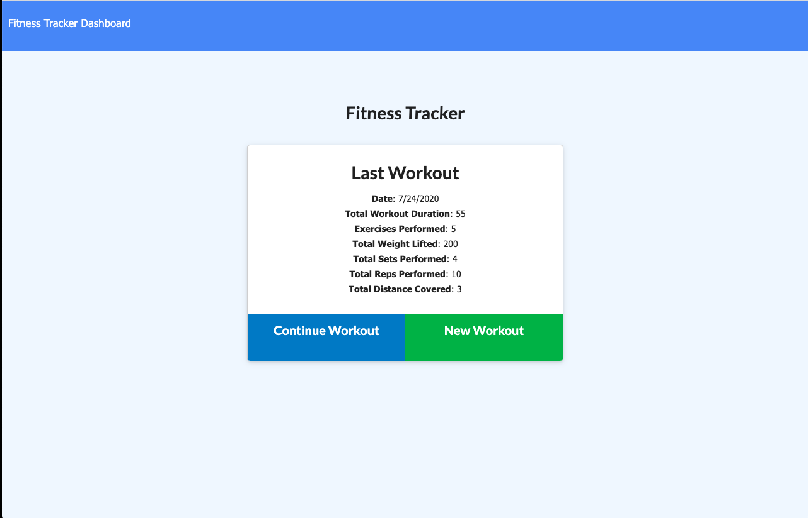
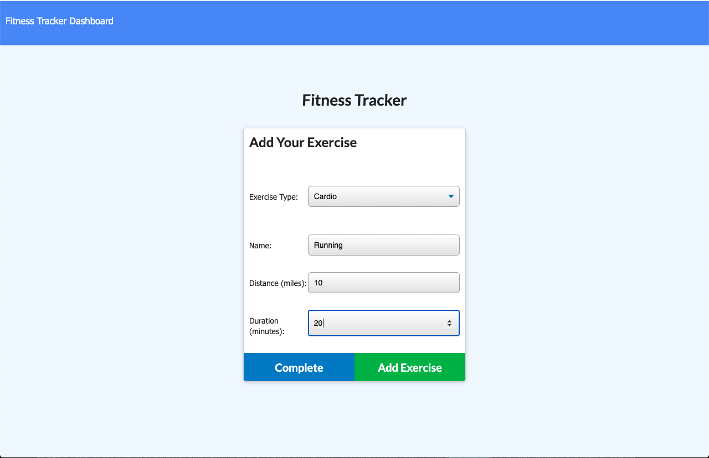
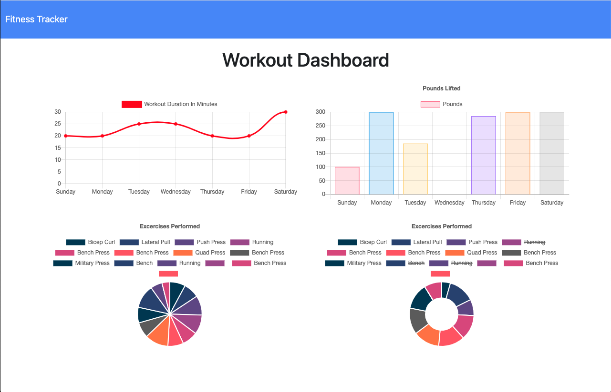

# Workout Tracker

This full stack application allows a user to input a workout, continue with that workout, see their workout progression on charts and see their latest workout.

This app was created using MongoDB, Mongoose, Express, and Node.js.

##  Installation

If running from the console - use `npm install` to install all needed dependencies and `npm run seed` to seed the database.

## Application Visual

### Home Page

### Add a New/Update an Excercise Page

### Charts Page

## Where To Find This App

[GitHub Repository](https://github.com/karenastell/workout-tracker)

[Heroku](https://protected-ravine-89620.herokuapp.com/)